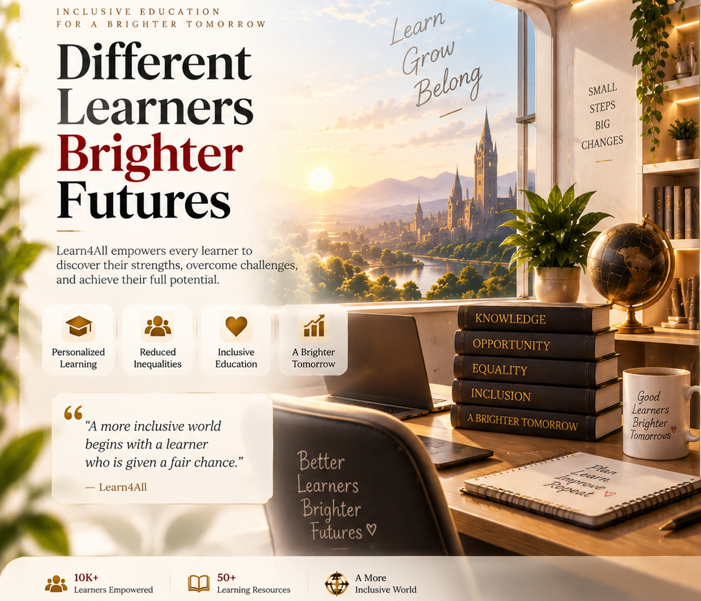

<div align="center">



# ✦ LEARN4ALL — VIDYAPATH ✦
### **From Assessment Data to the Next Best Learning Action**

**Team VidyaNova** · **HACK-AI-THON 2026 · National Level**

<br/>

<a href="https://github.com/kumarprasana1805-dot/Learn4All-HackAIThon-2026">

</a>


<br/><br/>

> ## **Learn Today · Understand Better · Grow Tomorrow**

</div>

---

# 🚀 How to Use Learn4All

> **Start here.** This section is intentionally placed near the top so a teacher/evaluator can run the project immediately without searching through the documentation.

## 1. Requirements

You need:

- **Python 3.x**
- A modern web browser
- Internet access for installing Python dependencies
- Network access when using dynamic external-source topic retrieval

---

## 2. Download / Clone the Project

### Option A — Clone from GitHub

```bash
git clone https://github.com/kumarprasana1805-dot/Learn4All-HackAIThon-2026.git
cd Learn4All-HackAIThon-2026
```

### Option B — Download ZIP

Download the repository from GitHub, extract it, and open a terminal inside the extracted project folder.

---

## 3. Create a Virtual Environment

```bash
python -m venv .venv
```

---

## 4. Activate the Environment

### Windows PowerShell

```powershell
.\.venv\Scripts\Activate.ps1
```

### Windows Command Prompt

```bat
.venv\Scripts\activate
```

---

## 5. Install Dependencies

```bash
python -m pip install -r requirements.txt
```

---

## 6. Start Learn4All

```bash
python app.py
```

When Flask starts successfully, open:

**http://127.0.0.1:5000**

---

## 7. What to Demonstrate

### 👨‍🎓 Student Demo

```text
Login / Signup
      ↓
Welcome
      ↓
Student Dashboard
      ↓
Add / View Assessments
      ↓
Performance Analysis
      ↓
Weak Topics & Strengths
      ↓
Recommended Resources
      ↓
Notes / Video / Quiz / Practice
      ↓
Individual Learner Report
```

### 👩‍🏫 Teacher Demo

Use the authorized teacher account:

```text
Email:    teacher@learn4all.in
Password: Teacher@123
```

Then demonstrate:

```text
Teacher Login
      ↓
Teacher Dashboard
      ↓
Class-Level Summary
      ↓
Student Progress
      ↓
Individual Student Analysis
      ↓
Common Weak Topics / Improvement
```

> **Important:** teacher access is protected by backend role authorization, not simply by hiding teacher buttons in the UI.

---

## 8. Quick Demo Path

For a short competition demonstration, follow this order:

**1. Login → 2. Dashboard → 3. Assessment → 4. Performance → 5. Weak Topic → 6. Recommended Resource → 7. Learner Report → 8. Teacher Dashboard**

This sequence shows the complete **data → analysis → recommendation → action** pipeline.

---

# 🧭 Quick Navigation

| Section | Purpose |
|---|---|
| 🚀 **How to Use** | Run and demonstrate the project |
| 🎯 **Project Overview** | Understand Learn4All |
| 🚨 **Problem Statement** | Understand the real-world problem |
| 💡 **Solution** | See how the problem is addressed |
| 🌍 **SDG Alignment** | See sustainability relevance |
| ✨ **Features** | Explore student/teacher capabilities |
| ⚙️ **How It Works** | Understand the complete workflow |
| 🧠 **Recommendation Engine** | Understand personalization |
| 🏗️ **OOP & Architecture** | Understand Python/OOP implementation |
| 💻 **Code Highlights** | See core implementation logic |
| 🖥️ **Interface & Design** | Understand the UI/UX |
| 🛡️ **Accuracy & Reliability** | Understand source verification |
| 🔐 **Security** | Understand authentication/access |
| 🧪 **Testing** | Understand validation |
| 🛠️ **Technology Stack** | Technologies used |
| 📁 **Repository Structure** | Understand the codebase |
| 🏆 **Requirement Mapping** | Challenge-to-feature mapping |
| 👥 **Team** | Team information |
| 🔗 **Repository** | Source code |
| 🔮 **Future Scope** | Possible improvements |

---

# 🎯 Project Overview

## What is Learn4All?

**Learn4All — VidyaPath** is a Python-first educational platform built around one simple idea:

> **A student's result should not be the end of the learning process — it should tell the learner what to do next.**

A conventional result system can tell a learner:

> **“You scored 52%.”**

Learn4All goes one step further:

> **“Here is the topic that needs attention, the relevant learning material, and the next action you can take.”**

The platform analyses assessment performance, identifies strengths and weak topics, recommends topic-specific resources, and generates an individual learner report.

A protected teacher workspace provides **class-level and student-level progress insights**, helping educators identify common learning gaps.

---

# 🚨 Problem Statement

## The real-world problem

Students often receive marks after an assessment, but marks alone do not answer the questions that matter for the next stage of learning:

- ❓ What exactly am I weak in?
- ❓ Which topic should I revise first?
- ❓ Which resource should I use?
- ❓ Should I revise concepts, practise, or take a quiz?
- ❓ Am I improving over time?
- ❓ What should I do next?

Teachers face a parallel challenge: analysing many learner results manually to discover **individual weaknesses and common class-level learning gaps** can be time-consuming.

## Existing gap

```text
Traditional Result System
        ↓
       Score
        ↓
      Display
        ✕
   "What next?"
```

## The problem we solve

> **How can assessment data be transformed into personalized, actionable learning support instead of remaining only a collection of marks?**

---

# 💡 Proposed Solution

Learn4All creates a connected path from **assessment → insight → resource → action**.

### 01 · Capture

Assessment results are recorded against a learner, subject and topic.

### 02 · Analyse

The application calculates topic-wise, subject-wise and overall performance.

### 03 · Identify

Low-performing topics are surfaced as areas requiring attention, while high-performing topics are recognized as strengths.

### 04 · Recommend

The resource recommender matches identified learning gaps with relevant learning resources.

### 05 · Learn

The learner can use available **notes, videos, quizzes and practice material**.

### 06 · Report

An individual learner report combines performance, strengths, weak topics, recommended resources and next actions.

### 07 · Support Teachers

Class-level aggregation helps teachers see common topic gaps and student progress.

---

# 🌍 SDG Alignment

## 🎓 SDG 4 — Quality Education

Learn4All supports **inclusive and equitable quality education** by helping learners understand academic gaps and connect performance information with targeted learning support.

## 🤝 SDG 10 — Reduced Inequalities

The resource model includes accessibility information so accessible resources can be preferred when a learner has recorded accessibility needs.

| Educational Challenge | Learn4All Response |
|---|---|
| Learner cannot easily identify weak areas | Topic-level performance analysis |
| Marks do not explain the next step | Personalized next actions |
| Generic study material | Subject + topic resource matching |
| Different resource formats are useful | Video / Notes / Quiz / Practice |
| Teachers need a broader view | Class-level summary |
| Learners may have accessibility needs | Accessibility-aware resource preference |

---

# ✨ Features

## 👨‍🎓 Student Workspace

### Authentication
- Secure signup/login
- Password hashing
- Session-based access
- Student-specific data isolation

### Learning & Analysis
- Assessment tracking
- Subject-wise performance
- Topic-wise performance
- Overall performance
- Strength detection
- Weak-topic detection
- Personalized recommendations
- Individual learner report

### Learning Resources
- 🎬 Video
- 📖 Notes
- ❓ Quiz
- ✍️ Practice

---

## 👩‍🏫 Teacher Workspace

- 🔒 Role-protected teacher authentication
- 👥 Class-level performance summary
- 📊 Student progress monitoring
- 🎯 Common weak-topic analysis
- 📈 Improvement/progress information
- 🔎 Individual student analysis

---

## 🔐 Platform Capabilities

- Password hashing
- Session authentication
- Backend role authorization
- Input validation
- Exception/error handling
- SQLite persistence
- Resource caching
- Source-relevance checks
- Reduced-motion support

---

# ⚙️ How It Works

## Complete Learning Pipeline

```text
                    ┌─────────────────┐
                    │    Assessment   │
                    └────────┬────────┘
                             ↓
                    ┌─────────────────┐
                    │    Performance  │
                    │     Analysis    │
                    └────────┬────────┘
                             ↓
                 ┌───────────┴───────────┐
                 ↓                       ↓
          ┌─────────────┐         ┌─────────────┐
          │  Strengths  │         │ Weak Topics │
          └─────────────┘         └──────┬──────┘
                                         ↓
                                ┌─────────────────┐
                                │ Recommendation  │
                                │     Engine      │
                                └────────┬────────┘
                                         ↓
                              ┌─────────────────────┐
                              │ Relevant Resources  │
                              │ Video / Notes /     │
                              │ Quiz / Practice     │
                              └──────────┬──────────┘
                                         ↓
                                  ┌──────────────┐
                                  │ Next Action  │
                                  └──────────────┘
```

## Student journey

```text
Login
  ↓
Welcome
  ↓
Dashboard
  ↓
Assessment
  ↓
Performance
  ↓
Weak Topics
  ↓
Resources
  ↓
Report
```

## Teacher journey

```text
Teacher Login
      ↓
Class Overview
      ↓
Student Progress
      ↓
Common Weak Topics
      ↓
Individual Student Analysis
```

---

# 🧠 Recommendation Engine

The recommendation engine connects **performance data** with **learning resources**.

## Decision Pipeline

```text
Assessment Score
       ↓
Topic Performance
       ↓
Is topic below threshold?
       │
   ┌───┴───┐
   │       │
  YES      NO
   │       │
   ▼       ▼
 Weak    Possible
 Topic   Strength
   │
   ▼
Find matching resources
   │
   ▼
Subject + Topic + Category
   │
   ▼
Accessibility preference
   │
   ▼
Recommended Resources
```

## Performance interpretation

| Performance | Interpretation |
|---:|---|
| **< 60%** | Weak / focus area |
| **60%–79.9%** | Developing / improvement area |
| **≥ 80%** | Strength |

## Resource categories

| Resource | Learning purpose |
|---|---|
| 🎬 Video | Visual/audio explanation |
| 📖 Notes | Concept revision |
| ❓ Quiz | Knowledge checking |
| ✍️ Practice | Skill reinforcement |

---

# 🛡️ Accuracy & Reliability

## Why accuracy matters

Learn4All is an educational application. Showing unrelated information as factual learning content can mislead learners.

Therefore, the dynamic resource layer follows an accuracy-first approach.

### Curated content

Known classroom topics can use bundled learning material.

### Dynamic content

Other topics can use source-backed MediaWiki/Wikipedia retrieval.

### Verification flow

```text
Topic Request
     ↓
Source Discovery
     ↓
Relevance Check
     ↓
┌────┴────┐
│         │
PASS     FAIL
│         │
▼         ▼
Use     Withhold
source  factual content
```

> **No sufficiently relevant verified source → do not invent factual topic content.**

The application also avoids obvious media/pop-culture/disambiguation contamination and does not simply concatenate unrelated search results.

For arbitrary topics, factual correctness should still be checked against the prescribed school textbook/syllabus.

---

# 🏗️ OOP & Architecture

The project is primarily implemented in **Python** and demonstrates the required Object-Oriented Programming structure.

## Core domain model

```text
                         ┌──────────────┐
                         │   Student    │
                         └──────┬───────┘
                                │
                         has many│
                                ↓
                         ┌──────────────┐
                         │  Assessment  │
                         └──────┬───────┘
                                │
                                ↓
                         ┌──────────────┐
                         │   Subject    │
                         └──────────────┘


┌──────────────────┐      ┌──────────────────────┐
│     Resource     │◄─────│ ResourceRecommender  │
└──────────────────┘      └──────────┬───────────┘
                                     │
                                     ↓
                                  Student

┌──────────────────┐       ┌──────────────────┐
│  LearnerReport   │──────►│     Student      │
└──────────────────┘       └──────────────────┘

┌──────────────────┐       ┌──────────────────┐
│  ClassSummary    │──────►│     Students     │
└──────────────────┘       └──────────────────┘
```

## Core classes

| Class | Responsibility |
|---|---|
| `Student` | Learner profile, accessibility needs and assessment history |
| `Subject` | Subject/topic structure |
| `Assessment` | Assessment score and percentage |
| `Resource` | Learning resource metadata |
| `ResourceRecommender` | Matches learning gaps with resources |
| `LearnerReport` | Builds individual learner insights |
| `ClassSummary` | Builds class-level insights |

---

# 💻 Code Highlights

The important learning logic is kept in reusable Python classes.

<details>
<summary><strong>Assessment percentage calculation</strong></summary>

```python
class Assessment:
    """One assessment result for one topic."""

    def __init__(self, subject, topic, score, max_score=100):
        self.subject = subject
        self.topic = topic
        self.score = float(score)
        self.max_score = float(max_score)

    @property
    def percentage(self):
        return (
            round((self.score / self.max_score) * 100, 1)
            if self.max_score > 0 else 0.0
        )
```

</details>

<details>
<summary><strong>Weak-topic and strength detection</strong></summary>

```python
class Student:
    WEAK_THRESHOLD = 60
    STRENGTH_THRESHOLD = 80

    def weak_topics(self):
        return [
            {
                "subject": subject,
                "topic": topic,
                "percentage": percentage
            }
            for (subject, topic), percentage
            in self.performance_by_topic().items()
            if percentage < self.WEAK_THRESHOLD
        ]

    def strengths(self):
        return [
            {
                "subject": subject,
                "topic": topic,
                "percentage": percentage
            }
            for (subject, topic), percentage
            in self.performance_by_topic().items()
            if percentage >= self.STRENGTH_THRESHOLD
        ]
```

</details>

<details>
<summary><strong>Personalized resource matching</strong></summary>

```python
class ResourceRecommender:
    """Match weak topics to relevant resources."""

    def recommend(self, student, limit_per_topic=2):
        result = {}

        for weak in student.weak_topics():
            matches = [
                resource
                for resource in self.resources
                if self._same(resource.topic, weak["topic"])
                and self._same(resource.subject, weak["subject"])
            ]

            if student.accessibility_needs:
                matches = (
                    [r for r in matches if r.accessible]
                    or matches
                )

            result[weak["topic"]] = matches[:limit_per_topic]

        return result
```

</details>

> These examples show the central domain logic behind assessment analysis and personalized resource matching.

---

# 📄 Individual & Class Reporting

## Individual learner report

```text
Overall Average
      +
Subject Performance
      +
Strengths
      +
Weak Topics
      +
Recommended Resources
      +
Next Actions
```

## Class-level summary

```text
Student A ─┐
Student B ─┼──► Class Performance
Student C ─┘

Weak Topics
    ↓
Common Topic Gaps
    ↓
Teacher Insight
```

---

# 🖥️ Interface & Design

Learn4All is designed as a complete web application rather than a plain command-line prototype.

## 🎨 Visual identity

| Element | Design direction |
|---|---|
| Background | Warm Ivory / Cream |
| Surfaces | White / Elevated White |
| Primary | Deep Burgundy |
| Highlight | Royal Crimson |
| Accent | Antique Gold |
| Text | Dark Charcoal |
| Typography | Refined Serif + Modern Sans |
| Depth | Soft cinematic shadows |
| Motion | Smooth, subtle, purposeful |
| Accessibility | Reduced-motion support |

### Design philosophy

> **Premium enough to impress. Simple enough to use.**

The interface combines a premium educational atmosphere with practical navigation.

### Interaction polish

- Page entrance transitions
- Scroll reveal
- Card hover/lift
- Button interaction effects
- Progress animation
- Subtle ambient motion
- Login artwork parallax
- Reduced-motion handling

---

# 🖼️ Interface Preview

The repository already contains the application's visual assets under `static/images/` and learning media under `static/videos/`.

### Login / Landing Experience


### Main application areas

The working prototype contains dedicated pages for:

- 🔐 Login / Signup
- 👋 Welcome
- 📊 Student Dashboard
- 📝 Assessments
- 📈 Performance
- 🎯 Weak Topics
- 📚 Resources
- 📄 Learner Report
- 👩‍🏫 Teacher Dashboard
- 👤 Student Progress
- ⚙️ Profile / Settings
- ℹ️ Help / About / Contact

---

# 🔐 Security & Access Control

## Student access

```text
Student Login
     ↓
Authenticated Session
     ↓
Own Student Context
     ↓
Own Assessments / Progress / Report
```

## Teacher access

```text
Teacher Login
     ↓
Role Check
     ↓
Authorized Teacher Routes
     ↓
Class + Student Progress
```

### Security mechanisms

- Password hashing
- Session authentication
- Backend role checks
- Input validation
- Controlled database access
- Error handling

---

# 🗄️ Data Model

```text
USERS
 ├── id
 ├── name
 ├── email
 ├── password_hash
 ├── role
 └── accessibility_needs

ASSESSMENTS
 ├── student_id
 ├── subject
 ├── topic
 ├── score
 ├── max_score
 └── taken_at

RESOURCES
 ├── title
 ├── subject
 ├── topic
 ├── category
 ├── accessible
 └── description

CONTACT_MESSAGES
 ├── name
 ├── email
 ├── message
 └── created_at
```

---

# 🧪 Testing & Validation

The repository includes automated tests and the project focuses on both interface and underlying logic.

## Validation areas

| Area | Purpose |
|---|---|
| Python compilation | Catch syntax/module errors |
| Core OOP tests | Validate domain behaviour |
| Assessment calculation | Validate percentage logic |
| Performance analysis | Validate derived indicators |
| Weak-topic detection | Validate learning-gap logic |
| Resource recommendation | Validate topic matching |
| Accessibility preference | Validate resource prioritization |
| Authentication | Validate account workflow |
| Authorization | Validate teacher-only access |
| Persistence | Validate SQLite-backed data |
| Resource engine | Validate source/fallback behaviour |

### Quick test commands

```bash
python -m py_compile app.py learn4all.py
pytest -q
```

---

# 🛠️ Technology Stack

| Technology | Role |
|---|---|
| 🐍 **Python** | Core application logic + OOP |
| 🌐 **Flask** | Web application/backend |
| 🗄️ **SQLite** | Persistent local data |
| 🧱 **HTML5** | Interface structure |
| 🎨 **CSS3** | UI, layout and animation |
| ⚡ **JavaScript** | Client-side interaction |
| 🧩 **Jinja2** | Dynamic template rendering |
| 🖼️ **Pillow** | Image/media processing |
| 🎬 **FFmpeg / imageio-ffmpeg** | MP4 generation |
| 🌍 **MediaWiki / Wikipedia APIs** | Source-backed dynamic topic retrieval |

---

# 📁 Repository Structure

```text
Learn4All/
│
├── app.py
│       └── Flask application, routes and web flow
│
├── learn4all.py
│       └── Python OOP domain models + analysis/recommendation logic
│
├── requirements.txt
│       └── Python dependencies
│
├── README.md
│       └── Project documentation
│
├── generate_selected.py
├── generate_videos.py
├── patch_resources.py
├── upgrade_notes.py
│
├── static/
│   ├── css/
│   ├── js/
│   ├── images/
│   └── videos/
│
├── templates/
│
└── tests/
```

---

# 🏆 HACK-AI-THON 2026 — Requirement Mapping

Learn4All is aligned with the official **Learn4All – Inclusive Learning Progress & Resource Planner** challenge.

| Challenge requirement | Implementation |
|---|:---:|
| Primarily Python | ✅ |
| Python Fundamentals | ✅ |
| Object-Oriented Programming | ✅ |
| `Student` class | ✅ |
| `Subject` class | ✅ |
| `Assessment` class | ✅ |
| `Resource` class | ✅ |
| Store assessment results | ✅ |
| Performance indicators | ✅ |
| Weak-topic identification | ✅ |
| Personalized recommendations | ✅ |
| Video resources | ✅ |
| Notes resources | ✅ |
| Quiz resources | ✅ |
| Practice resources | ✅ |
| Individual learner report | ✅ |
| Class-level summary | ✅ |
| Accessibility-aware resources | ✅ |
| SDG alignment | ✅ |
| Functional prototype | ✅ |

---

# 📊 Expected Output

## Individual learner

```text
┌──────────────────────────────────────┐
│        LEARNER PROGRESS REPORT       │
├──────────────────────────────────────┤
│ Overall Performance                  │
│ Subject Performance                  │
│ Strengths                            │
│ Weak Topics                          │
│ Recommended Resources                │
│ Next Actions                         │
└──────────────────────────────────────┘
```

## Teacher

```text
┌──────────────────────────────────────┐
│           CLASS SUMMARY              │
├──────────────────────────────────────┤
│ Student Performance                  │
│ Class-Level Insights                 │
│ Common Weak Topics                   │
│ Individual Progress                  │
│ Improvement Information              │
└──────────────────────────────────────┘
```

---

# 🧩 Key Design Decisions

### Why Python?

Python is the primary implementation language required by the challenge and provides a natural way to demonstrate functions, data structures, classes and application logic.

### Why Flask?

Flask provides a lightweight way to expose the Python learning logic through a browser-based application.

### Why SQLite?

SQLite provides persistent local storage without requiring a separate database server.

### Why OOP?

The learning domain naturally maps to objects:

**Student → Assessment → Subject → Resource → Recommendation → Report**

This keeps the domain logic modular and reusable.

### Why source verification?

Because educational content should not silently turn an unrelated external result into a factual lesson.

---

# 📋 Submission Readiness

| Deliverable | Status |
|---|:---:|
| Project title | ✅ |
| Team name | ✅ |
| Team members & schools | ✅ |
| Problem statement | ✅ |
| Solution description | ✅ |
| SDG mapping | ✅ |
| System workflow | ✅ |
| OOP/class design | ✅ |
| Algorithms & logic | ✅ |
| Technology stack | ✅ |
| Testing | ✅ |
| Security/access control | ✅ |
| Limitations | ✅ |
| Future scope | ✅ |
| Run guide | ✅ |
| Demo credentials | ✅ |
| GitHub repository link | ✅ |

---

# ⚠️ Limitations

Learn4All is a competition prototype with practical boundaries:

- Dynamic external-source retrieval depends on network availability.
- Arbitrary-topic factual correctness depends on the retrieved source and should be checked against the prescribed syllabus/textbook.
- Curriculum mapping can be expanded for more boards, subjects and grade levels.
- The prototype uses local SQLite rather than a production-scale cloud database.
- The current resource library can be expanded further.

These limitations are documented intentionally rather than hidden.

---

# 🔮 Future Scope

Potential extensions include:

- 📚 Board- and syllabus-specific curriculum mapping
- 🧑‍🏫 More advanced teacher analytics
- 📈 Long-term learning trends
- ♿ Expanded accessibility options
- 📝 More assessment formats
- 📖 Larger curated resource library
- 🔍 Stronger textbook-aligned source verification
- 🏫 Institution-level deployment

---

# 👥 Team VidyaNova

## Team Members

| Member | School |
|---|---|
| **Kumar Prasanna** | Sunbeam School, Ballia, Uttar Pradesh |
| **Vaibhav** | SPS International School, Haryana |

### Why “VidyaNova”?

**Vidya** represents knowledge and learning.

**Nova** represents a new beginning and a bright new direction.

Together, **VidyaNova** represents our vision of creating a smarter and more supportive path for learning.

---

# 🔗 GitHub Repository

## **[Learn4All — HACK-AI-THON 2026](https://github.com/kumarprasana1805-dot/Learn4All-HackAIThon-2026)**

**Public Repository · `main` branch**

The repository contains the project source code, templates, static assets, tests, dependency file and supporting utilities.

---

# ❤️ Our Vision

<div align="center">

## **A score should not be the end of learning.**
## **It should be the starting point for the next better step.**

<br/>

### **ASSESS → UNDERSTAND → IMPROVE → GROW**

<br/>

# ✦ TEAM VIDYANOVA ✦

**Learn Today · Understand Better · Grow Tomorrow**

**HACK-AI-THON 2026 · National Level**

<br/>

*Built with Python · Structured with OOP · Designed for Learning · Aligned with the SDGs*

</div>
