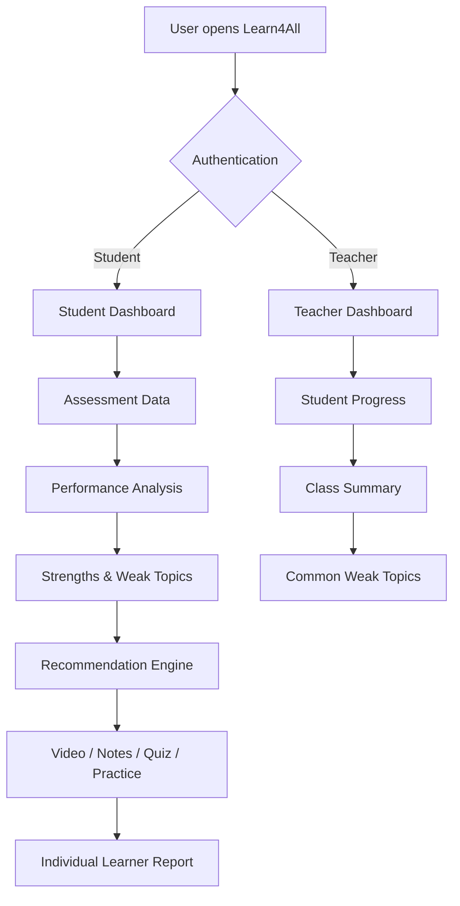

<div align="center">

# ✦ LEARN4ALL — VIDYAPATH ✦
### **Personalized Learning • Performance Intelligence • Actionable Resources**

**Team VidyaNova**  
*HACK-AI-THON 2026 · National Level*


<br/>

### **Learn Today · Understand Better · Grow Tomorrow**

<p>
<a href="https://github.com/kumarprasana1805-dot/Learn4All-HackAIThon-2026">

</a>


</p>

</div>

---

## 🏆 Project at a Glance

| | |
|---|---|
| **Project** | Learn4All — VidyaPath |
| **Challenge** | Learn4All – Inclusive Learning Progress & Resource Planner |
| **Competition** | HACK-AI-THON 2026 · National Level |
| **Theme** | Python Fundamentals + OOP + SDGs |
| **Primary Language** | Python |
| **Web Framework** | Flask |
| **Database** | SQLite |
| **Core Approach** | OOP + Performance Analysis + Resource Recommendation |
| **Primary SDG** | SDG 4 — Quality Education |
| **Additional SDG** | SDG 10 — Reduced Inequalities |
| **Team** | Team VidyaNova |

---

# 🎯 What is Learn4All?

**Learn4All — VidyaPath** is a Python-based learning support platform that turns assessment results into **personalized learning actions**.

A conventional result system can tell a learner:

> **“You scored 52%.”**

Learn4All goes one step further:

> **“Here is the topic that needs attention, the relevant learning material, and the next action you can take.”**

The platform analyses assessment performance, identifies strengths and weak topics, recommends topic-specific resources, and generates an individual learner report. A protected teacher dashboard provides class-level insights so educators can see broader learning gaps.

---

# 🚨 The Problem We Address

## The real-world problem

Students often receive marks after an assessment, but marks alone do not answer the most important learning questions:

- ❓ **What exactly am I weak in?**
- ❓ **Which topic should I revise first?**
- ❓ **What resource should I use?**
- ❓ **Am I improving?**
- ❓ **What should I do next?**

Teachers face another challenge: manually examining many assessment records to understand individual weaknesses and common class-level gaps can be time-consuming.

### The gap

**Traditional result systems are mainly score-oriented.**

**Learn4All is action-oriented.**

---

# 💡 Our Solution

Learn4All creates a complete learning loop:

```text
                ┌──────────────────┐
                │ Student Assessment│
                └────────┬─────────┘
                         ↓
                ┌──────────────────┐
                │ Performance      │
                │ Analysis         │
                └────────┬─────────┘
                         ↓
             ┌───────────┴───────────┐
             ↓                       ↓
       ┌───────────┐           ┌───────────┐
       │ Strengths │           │ Weak Areas│
       └───────────┘           └─────┬─────┘
                                     ↓
                            ┌─────────────────┐
                            │ Recommendation  │
                            │ Engine          │
                            └────────┬────────┘
                                     ↓
                         ┌────────────────────┐
                         │ Relevant Resources │
                         │ Video / Notes /    │
                         │ Quiz / Practice    │
                         └─────────┬──────────┘
                                   ↓
                            ┌───────────────┐
                            │ Next Action   │
                            └───────────────┘
```

### Core idea

> **Assessment data → meaningful insight → personalized resource → next learning action**

This is the central design philosophy of Learn4All.

---

# 🌍 SDG Alignment

## 🎓 SDG 4 — Quality Education

Learn4All supports **inclusive and equitable quality education** by helping learners understand their academic gaps and receive targeted learning support.

## 🤝 SDG 10 — Reduced Inequalities

The resource recommendation system can consider **accessibility needs** and prefer accessible resources when appropriate, helping reduce barriers to learning.

| SDG Goal | Project Contribution |
|---|---|
| **SDG 4** | Personalized learning support and progress awareness |
| **SDG 10** | Accessibility-aware resource matching |

---

# ✨ Core Features

### 👨‍🎓 Student Portal

**Authentication**
- Secure signup/login
- Password hashing
- Session-based access
- Student-specific data isolation

**Learning & Analysis**
- Assessment tracking
- Subject-wise performance
- Topic-wise performance
- Overall average
- Strength detection
- Weak-topic detection
- Personalized recommendations
- Learning resources
- Individual learner report

**Resources**
- 🎬 Video
- 📖 Notes
- ❓ Quiz
- ✍️ Practice

### 👩‍🏫 Teacher Portal

- Role-protected teacher login
- Class-level performance summary
- Student-wise progress
- Common weak-topic analysis
- Individual student view
- Improvement/progress visibility

> **Important:** teacher-only access is enforced at the backend route/authorization level; it is not merely hidden from the interface.

---

# 🧠 How the Recommendation Engine Works

A recommendation is not randomly selected.

### Step 1 — Find performance

Assessment scores are grouped by subject and topic.

### Step 2 — Identify learning gaps

The application compares topic performance with configured thresholds.

- **Below 60% → Weak topic**
- **80% or above → Strength**

### Step 3 — Match resources

Resources are matched using:

```text
Subject + Topic + Resource Category
```

### Step 4 — Accessibility preference

If accessibility needs are recorded, accessible matching resources are preferred where available.

### Step 5 — Produce next actions

The learner report connects the weak topic with recommended learning material and a concrete revision action.

---

# 🛡️ Accuracy-First Resource Retrieval

For known classroom topics, Learn4All can use curated resource packs.

For other topics, the application can use source-backed MediaWiki/Wikipedia retrieval.

The system deliberately avoids turning an unrelated or ambiguous source into factual educational content.

### Accuracy principle

```text
Relevant verified source
        ↓
     Use it
        │
        └─────── No reliable source
                         ↓
                Do NOT invent facts
```

> **No verified source → no fabricated factual lesson.**

This matters because an educational application should prefer **honest unavailability over confident misinformation**.

---

# 🏗️ Object-Oriented Programming

The project is primarily implemented in Python and demonstrates the required OOP structure.

## Core domain classes

```text
                         ┌──────────────┐
                         │   Student    │
                         └──────┬───────┘
                                │
                         has many│
                                ↓
                         ┌──────────────┐
                         │  Assessment  │
                         └──────┬───────┘
                                │
                    belongs to  │
                                ↓
                         ┌──────────────┐
                         │   Subject    │
                         └──────────────┘


┌──────────────────┐      ┌──────────────────────┐
│     Resource     │◄─────│ ResourceRecommender  │
└──────────────────┘      └──────────┬───────────┘
                                     │
                                     ↓
                                  Student

┌──────────────────┐       ┌──────────────────┐
│  LearnerReport   │──────►│     Student      │
└──────────────────┘       └──────────────────┘

┌──────────────────┐       ┌──────────────────┐
│  ClassSummary    │──────►│     Students     │
└──────────────────┘       └──────────────────┘
```

### Class responsibilities

| Class | Responsibility |
|---|---|
| `Student` | Learner profile, accessibility needs and assessment history |
| `Subject` | Represents a subject and its topics |
| `Assessment` | Stores a score for a subject/topic |
| `Resource` | Represents a learning resource |
| `ResourceRecommender` | Matches weak topics with resources |
| `LearnerReport` | Builds individual learner insights |
| `ClassSummary` | Builds aggregate class-level insights |

---

# 💻 Code Highlights

The implementation keeps the important learning logic in reusable Python classes.

### Assessment percentage

```python
class Assessment:
    """One assessment result for one topic."""

    def __init__(self, subject, topic, score, max_score=100):
        self.subject = subject
        self.topic = topic
        self.score = float(score)
        self.max_score = float(max_score)

    @property
    def percentage(self):
        return (
            round((self.score / self.max_score) * 100, 1)
            if self.max_score > 0 else 0.0
        )
```

### Weak-topic detection

```python
class Student:
    WEAK_THRESHOLD = 60
    STRENGTH_THRESHOLD = 80

    def weak_topics(self):
        return [
            {
                "subject": subject,
                "topic": topic,
                "percentage": percentage
            }
            for (subject, topic), percentage
            in self.performance_by_topic().items()
            if percentage < self.WEAK_THRESHOLD
        ]
```

### Personalized resource matching

```python
def recommend(self, student, limit_per_topic=2):
    result = {}

    for weak in student.weak_topics():
        matches = [
            resource
            for resource in self.resources
            if self._same(resource.topic, weak["topic"])
            and self._same(resource.subject, weak["subject"])
        ]

        if student.accessibility_needs:
            matches = (
                [resource for resource in matches if resource.accessible]
                or matches
            )

        result[weak["topic"]] = matches[:limit_per_topic]

    return result
```

### Individual report generation

```python
return {
    "student": self.student.name,
    "overall_average": self.student.overall_average(),
    "performance_by_subject":
        self.student.performance_by_subject(),
    "strengths": self.student.strengths(),
    "weak_topics": weak,
    "recommended_resources":
        self.recommender.recommend(self.student),
    "next_actions": [
        f"Revisit '{item['topic']}' using the recommended resources"
        for item in weak
    ],
}
```

> These snippets represent the actual core OOP/analysis logic used by the project.

---

# 🔄 End-to-End System Flow



---

# 🖥️ Product Experience

Learn4All is designed as a complete web application rather than a command-line-only prototype.

### Main experience

```text
Login / Signup
      ↓
Welcome Experience
      ↓
Student / Teacher Dashboard
      ↓
Separate functional pages
      ↓
Analysis + Resources + Reports
```

### Student journey

**Login → Dashboard → Assessments → Performance → Weak Topics → Resources → Report**

### Teacher journey

**Teacher Login → Class Overview → Student Progress → Weak Topics → Insights**

---

# 🎨 Interface Design System

The interface follows a consistent premium educational design language:

| Design Element | Direction |
|---|---|
| Background | Warm Ivory / Cream |
| Surfaces | White / Elevated White |
| Primary | Deep Burgundy |
| Highlight | Royal Crimson |
| Accent | Antique Gold |
| Typography | Refined Serif + Modern Sans |
| Depth | Soft cinematic shadows |
| Motion | Smooth, subtle interaction |
| Accessibility | Reduced-motion support |

### Visual philosophy

> **Premium enough to impress. Simple enough to use.**

---

# 📸 Interface Preview

### 🔐 Login Experience


*Premium authentication experience with the project's warm ivory, burgundy and gold visual identity.*

### 📊 Dashboard & Learning Workflow

The application includes dedicated interfaces for:

- Student dashboard
- Assessments
- Performance analysis
- Weak topics
- Learning resources
- Individual report
- Teacher dashboard
- Student progress view

> The repository's source tree contains the complete HTML templates, CSS, JavaScript, images and learning videos used by the working prototype.

---

# 🧪 Testing & Reliability

The project includes automated tests and focuses on more than visual correctness.

### Tested areas

- Python module compilation
- Core OOP behaviour
- Assessment calculations
- Performance analysis
- Weak-topic detection
- Strength detection
- Resource recommendation
- Accessibility-aware matching
- Authentication flows
- Role-based authorization
- Input validation
- Error handling
- SQLite persistence
- Resource-engine behaviour

### Design principle

> **A polished interface is useful only when the underlying logic is reliable.**

---

# 🔐 Security & Data Handling

Learn4All includes:

- Password hashing through Werkzeug
- Session-based authentication
- Backend authorization for teacher routes
- Input validation
- SQLite persistence
- Student-specific dashboard data
- No pre-populated fake student performance data

The application seeds only the required demo teacher/resource setup; learner information can be created through the application.

---

# 🗄️ Data Model

```text
USERS
 ├── id
 ├── name
 ├── email
 ├── password_hash
 ├── role
 └── accessibility_needs

ASSESSMENTS
 ├── student_id
 ├── subject
 ├── topic
 ├── score
 ├── max_score
 └── taken_at

RESOURCES
 ├── title
 ├── subject
 ├── topic
 ├── category
 ├── accessible
 └── description

CONTACT_MESSAGES
 ├── name
 ├── email
 ├── message
 └── created_at
```

---

# 🛠️ Technology Stack

### Backend

- **Python**
- **Flask**
- **SQLite**
- **Werkzeug**

### Frontend

- **HTML5**
- **CSS3**
- **JavaScript**
- **Jinja2 templates**

### Resource / Media Layer

- **MediaWiki / Wikipedia source-backed retrieval**
- **Pillow**
- **FFmpeg / imageio-ffmpeg**
- Local caching for retrieved/generated content

---

# 📁 Repository Structure

```text
Learn4All/
│
├── app.py                     # Flask application & routes
├── learn4all.py               # Core OOP/domain logic
├── requirements.txt           # Python dependencies
├── README.md                  # Project documentation
│
├── generate_selected.py       # Selected resource generation
├── generate_videos.py         # Video generation utilities
├── patch_resources.py         # Resource maintenance
├── upgrade_notes.py           # Notes/resource utilities
│
├── static/
│   ├── css/                   # Application styling
│   ├── js/                    # Client-side interaction
│   ├── images/                # Interface artwork
│   └── videos/                # Learning videos
│
├── templates/                 # Flask/Jinja pages
│
└── tests/                     # Automated tests
```

---

# 🚀 Run Locally

## Requirements

- Python 3.x
- Internet access for dependency installation
- A modern web browser

## 1. Clone

```bash
git clone https://github.com/kumarprasana1805-dot/Learn4All-HackAIThon-2026.git
cd Learn4All-HackAIThon-2026
```

## 2. Create virtual environment

```bash
python -m venv .venv
```

## 3. Activate — Windows PowerShell

```powershell
.\.venv\Scripts\Activate.ps1
```

## 4. Install dependencies

```bash
python -m pip install -r requirements.txt
```

## 5. Run

```bash
python app.py
```

## 6. Open

```text
http://127.0.0.1:5000
```

---

# 🔑 Demo Teacher Account

```text
Email:    teacher@learn4all.in
Password: Teacher@123
```

Use this account to demonstrate the authorized teacher workflow.

---

# 👥 Team VidyaNova

## Kumar Prasanna

**Sunbeam School, Ballia, Uttar Pradesh**

## Vaibhav

**SPS International School, Haryana**

### Why Team VidyaNova?

**Vidya** represents knowledge, learning and education.

**Nova** represents a new beginning and a bright direction.

**VidyaNova** therefore represents our vision of using technology to create a smarter, more supportive path for learners.

---

# 🏫 HACK-AI-THON 2026

### National Level · Team-Based Project Challenge

**Theme:**  
Python Fundamentals + Object-Oriented Programming (OOP) + Sustainable Development Goals

### Selected Challenge

**Learn4All – Inclusive Learning Progress & Resource Planner**

### Requirement Mapping

| Challenge Requirement | Learn4All Implementation |
|---|---|
| `Student` class | ✅ |
| `Subject` class | ✅ |
| `Assessment` class | ✅ |
| `Resource` class | ✅ |
| Store assessment results | ✅ |
| Performance indicators | ✅ |
| Weak-topic detection | ✅ |
| Personalized recommendations | ✅ |
| Video resources | ✅ |
| Notes resources | ✅ |
| Quiz resources | ✅ |
| Practice resources | ✅ |
| Individual learner report | ✅ |
| Class-level summary | ✅ |
| Python/OOP | ✅ |
| SDG alignment | ✅ |

---

# 📊 What the Evaluator Can See

### For a student

```text
Assessment
    ↓
Performance
    ↓
Strengths
    ↓
Weak Topics
    ↓
Recommended Resources
    ↓
Next Actions
    ↓
Learner Report
```

### For a teacher

```text
Student Records
      ↓
Class-Level Analysis
      ↓
Common Weak Topics
      ↓
Individual Progress
      ↓
Teacher Insight
```

This creates a clear bridge between **data, learning needs and action**.

---

# 🧩 Design Decisions

### Why Python?

Python is the primary implementation language required by the challenge and provides a clean way to demonstrate fundamentals, classes, functions, data structures and application logic.

### Why Flask?

Flask provides a lightweight way to expose the Python learning logic through a browser-based interface.

### Why SQLite?

SQLite provides simple persistent local storage without requiring a separate database server.

### Why OOP?

The domain naturally maps to objects:

**Student → Assessment → Subject → Resource → Recommendation → Report**

This makes the system modular and easier to extend.

---

# ⚠️ Current Limitations

Learn4All is a competition prototype, so some areas can be expanded further:

- Dynamic source retrieval depends on external network availability.
- Arbitrary-topic factual content depends on the quality/relevance of the retrieved source.
- Curriculum-specific mapping can be expanded for more boards and subjects.
- The current prototype uses local SQLite rather than a production cloud database.
- More institution-specific accessibility options can be added.

The application intentionally does **not** claim verified factual topic content when a reliable source cannot be established.

---

# 🔮 Future Scope

Potential extensions include:

- 📚 Board/syllabus-specific curriculum mapping
- 🧑‍🏫 Richer teacher analytics
- 📈 Long-term learning trends
- ♿ Expanded accessibility options
- 📖 Larger curated resource library
- 📝 More assessment formats
- 🏫 Institution-level deployment
- 🔍 Stronger syllabus-specific source verification

---

# 🔗 Repository & Source Code

## GitHub

### **[Learn4All — HACK-AI-THON 2026](https://github.com/kumarprasana1805-dot/Learn4All-HackAIThon-2026)**

**Public Repository · `main` branch**

---

# 📋 Submission Checklist

| Item | Status |
|---|:---:|
| Project title | ✅ |
| Team name | ✅ |
| Team members & schools | ✅ |
| Problem statement | ✅ |
| Solution description | ✅ |
| SDG mapping | ✅ |
| System workflow | ✅ |
| OOP/class design | ✅ |
| Algorithms & logic | ✅ |
| Technology stack | ✅ |
| Testing approach | ✅ |
| Limitations | ✅ |
| Future scope | ✅ |
| Run instructions | ✅ |
| Demo credentials | ✅ |
| GitHub repository link | ✅ |

---

# ❤️ Our Vision

> ### **A score should not be the end of learning.**
> ### **It should be the beginning of knowing what to do next.**

Learn4All — VidyaPath is built around that simple idea:

**Understand the learner.  
Find the gap.  
Recommend the right support.  
Take the next step.**

---

<div align="center">

## ✦ TEAM VIDYANOVA ✦

### **Learn Today · Understand Better · Grow Tomorrow**

**HACK-AI-THON 2026 · National Level**

<br/>

*Built with Python · Powered by OOP · Designed for Learning · Aligned with the SDGs*

</div>
